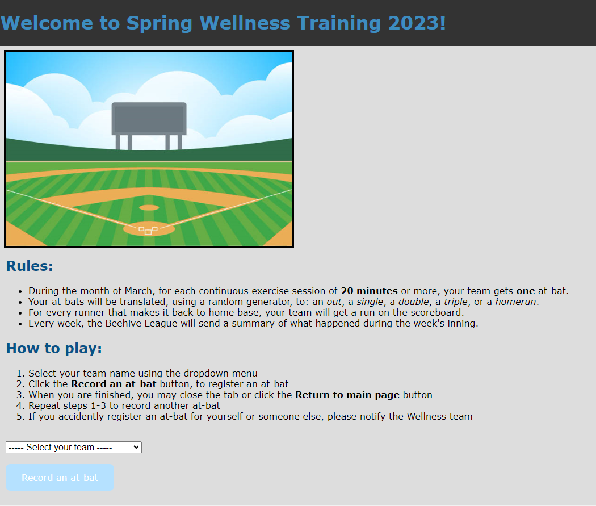

# wellness-spring-training

A baseball-themed web application developed for the WFRC wellness team using PHP and mySQL

Following these tutorials:
- https://medium.com/codeburst/how-to-style-your-website-with-css-e72e7046fda5
- https://medium.com/@blondiebytes/how-to-create-interactive-websites-with-javascript-627a6d998fed
- https://medium.com/@blondiebytes/get-your-website-on-the-web-with-github-pages-9bdc2886ae7a
- https://phptherightway.com/
- https://phpbestpractices.org/
- https://www.binpress.com/using-php-with-mysql/
- https://www.w3schools.com/php/php_ajax_database.asp
- https://freefrontend.com/css-select-boxes/
